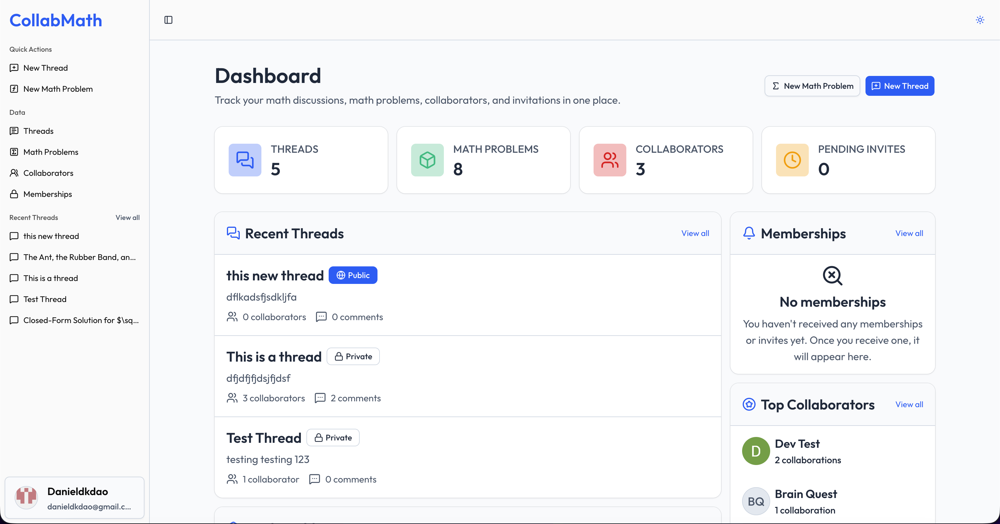
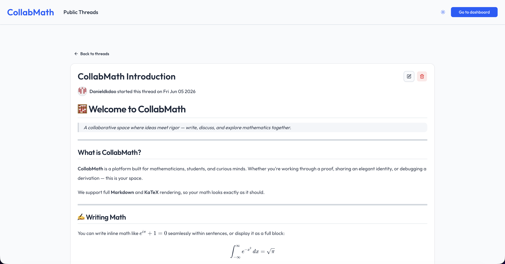
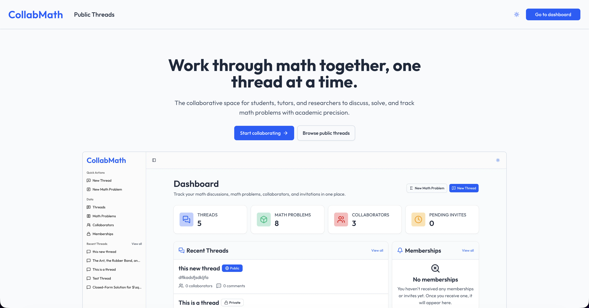

# 🔗 [CollabMath](https://collabmath.vercel.app)

## Overview

CollabMath is a platform that allows people to collaborate on math-related threads by selecting different problems and commenting. I built this project because my father (a mathematician) needed something like this and I suggested that I could help by using my skills to build it.

## What It Does

Some of the main features are:

- Intensive Markdown and LaTeX editor and rendering
- Private and public threads
- Reusable math problems across threads
- Clean dashboard to view and track your data
- Nested comments to allow for engaging discussions
- Invitation system to allow people to choose if they want to join a thread or not
- Full role-based access control for threads with owners having full access while collaborators have control over their content.
- Secure authentication and authorization
- Infinite scrolling lists to ensure seamless UX

## Screenshots / Photos

| Dashboard                                   | Thread interface                                   | Landing page                               |
| ------------------------------------------- | -------------------------------------------------- | ------------------------------------------ |
|  |  |  |

## Try it out!

Go to the [CollabMath](https://collabmath.vercel.app), hosted on Vercel. If you would rather run this locally, I have instructions below.

## Tech Stack

The platform was built using Next.js with React and TypeScript. Neon was used for the Postgres database and Drizzle was used as the ORM. For secure authentication and authorization, I used BetterAuth and verification emails are handled by Mailjet. I used tailwind CSS for styling and shadcn for prebuilt, customizable components. Forms use React Hook Form and zod handles validation on both the client and the server. React-MD-Editor allows for simple markdown editing and renderering and Katex allows for easy renderering of math symbols and LaTeX. PNPM was used as the package manager because with all the attacks around NPM packages lately, I have decided to switch (fingers crossed).

## Components / Dependencies

To run this project you will need a few things setup:

- Node.js (At least version 20.9, check the Next.js docs for more information)
- PNPM (The package manager used in this project)
- Git (To clone the repo to your local machine)

## Setup Instructions

### 1. Install Node.js (Skip if you already have installed)

Go to the [Node.js website](https://nodejs.org/en) and follow the installation instructions there to install it on your machine. To verify it is working, you can enter the following command:

```bash
node --version
npm --version
```

If both commands run successfully and print out version numbers with no "not found" errors, then you are good to go.

### 2. Install PNPM

This project uses PNPM as the package manager. To install, run:

```bash
npm install -g pnpm@latest
```

Once installed, you can verify it is working by running the following command:

```bash
pnpm --version
```

If it prints a version number with no errors, then you are good to go. Otherwise, please refer to the [PNPM documentation](https://pnpm.io/installation) for more information.

### 3. Install Git (If not already installed)

Go to the [Git website](https://git-scm.com) and follow the installation instructions there to install it on your system (if you don't already have it).

Then run the following command to verify that it works:

```bash
git --version
```

If no errors are raised, then you are good to continue.

### 4. Clone the Repo!

To clone, run:

```bash
git clone https://github.com/Danieldkdao/collab-math.git
cd collab-math
pnpm install
```

Once finished, open the project in your favorite IDE or code editor.

## Configuration

Because the project uses @t3-oss/env-nextjs for environment variables, it will throw an error if you try to run the application without any of the following variables in an .env file at the root of the application:

```text
// .env

# Neon
DATABASE_URL=

# Better Auth
BETTER_AUTH_SECRET=
BETTER_AUTH_URL=

# Google
GOOGLE_CLIENT_ID=
GOOGLE_CLIENT_SECRET=

# GitHub
GITHUB_CLIENT_ID=
GITHUB_CLIENT_SECRET=

# Mailjet
MAILJET_API_KEY=
MAILJET_API_SECRET=
SENDER_EMAIL=
```

## Running the Project

To start the project locally, simply run:

```bash
pnpm db:push
pnpm dev
```

To confirm that the project is running successfully, you can go to [localhost:3000](http://localhost:3000) in your browser. If you see the landing page, then it worked!

To build the project for production, you can run:

```bash
pnpm build
```

See the package.json for more information.

## How to Use

To use the application, you can go to [the website](https://collabmath.vercel.app) and explore. You can use it without signing up for an account, just go to the public threads page and find a public thread, review the content, and comment as an anonymous user. If you want to create your own threads and math problems, then you have to create an account.

## Troubleshooting

#### For local development

If you ran into any issues while trying to run the project locally, you can simply Google the issue or ask an LLM for help.

#### On the live website

If you found a bug, an issue, or just have a feature request please don't hesitate to email me at [danieldkdao@gmail.com](mailto:danieldkdao@gmail.com). I am actively working on this and I hope to make this a real thing used by real people, so I would appreciate any feedback or requests you may have!

## Credits

The project was solely my creation with some AI assistance. No outside reference regarding the initial idea or code was used.

### AI Usage

AI was used for some tasks which I have documented below. Every line of AI generated code was read, understood, and tweaked if necessary.

- Help troubleshoot and fix bugs
- Suggest next steps and new features
- Suggest ideas for the UI (none of the UI was built by AI, simply just suggestions for layout, style, etc)
- Helped in researching documentation for new packages/libraries
- Helped with the markdown components

No other collaborators worked on this project other than myself.

## License

This project is licensed under the MIT license.
